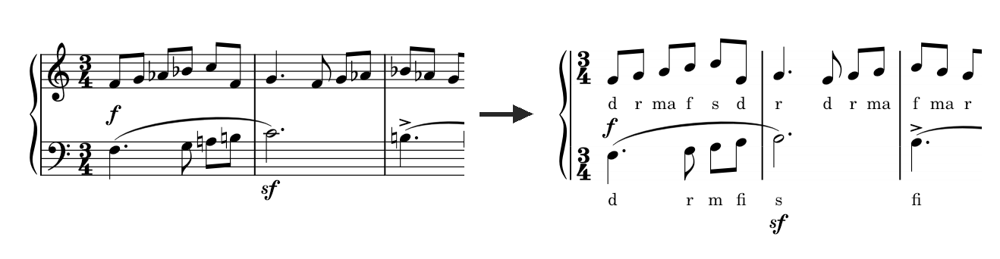

# Stick-Notation

Ein Plugin für [MuseScore Studio](https://musescore.org) 4.4+, das normale Notation in eine vereinfachte „Stick-Notation“ umwandelt: Notenlinien, Hilfslinien, Schlüssel, Vorzeichen und Versetzungszeichen werden ausgeblendet, und die Tonhöhen werden als Solmisationssilben (do re mi fa so la ti, inkl. Alterationen) unter die Noten geschrieben. Das Playback ändert sich dabei nicht – es werden nur Anzeige-Eigenschaften verändert, keine Tonhöhen.

## Funktionen

- **Notation vereinfachen** (unabhängig zuschaltbar): blendet Notenlinien, Hilfslinien, Schlüssel, Vorzeichen (Tonart) und Versetzungszeichen (einzelne Akzidenzien) aus.
- **Solmisationssilben hinzufügen** (unabhängig zuschaltbar): schreibt für jede Note die passende Silbe als neue Liedtext-Strophe.
- **„Wo liegt do?“** frei einstellbar:
  - Dur-Grundton der aktuellen Tonart
  - Moll-Grundton der aktuellen Tonart (relative Molltonart)
  - feste Tonhöhe, frei wählbar
- **Silben-System** wählbar, fünf Varianten:
  - Vier Varianten auf do-re-mi-Basis (erhöhte Töne immer `di ri fi si li`, erniedrigte Töne je nach Variante):
    - `ra ma su lo ta`
    - `ra ma sa lo ta`
    - `ra me se le te`
    - `ru mu su lu tu`
  - **Jale** (Richard Münnich, 1930): ein eigenständiges Silben-Alphabet mit der Grundreihe `ja le mi ni ro su wa`
- **Kurzform für unalterierte Töne** (`d r m f s l t`), damit Alterationen visuell auffallen.
- **Silben bei gebundenen Noten weglassen** (standardmäßig an): eine übergebundene Note bekommt keine eigene Silbe, da sie denselben Ton fortführt.
- Funktioniert korrekt bei transponierenden Instrumenten, sowohl in klingender als auch in transponierter Notation (Tonart wird jeweils passend umgerechnet).
- Ist vor dem Start ein Bereich in der Partitur markiert, wirkt das Plugin nur auf diesen; ohne Auswahl auf die gesamte Partitur.
- Die zuletzt verwendeten Einstellungen werden automatisch für den nächsten Durchlauf vorausgewählt.

## Installation

1. Diesen Ordner `stick-notation/` in das MuseScore-Plugins-Verzeichnis kopieren:
   - Windows: `%HOMEPATH%\Documents\MuseScore4\Plugins\`
   - macOS: `~/Documents/MuseScore4/Plugins/`
   - Linux: `~/Documents/MuseScore4/Plugins/`

   (Der Ordnername „Documents“ ist je nach Systemsprache lokalisiert, z. B. „Dokumente“ bei deutscher Spracheinstellung.)
2. MuseScore Studio starten, unter **Pläne → Plugins** (bzw. **Plugins → Plugins verwalten**) „Stick-Notation“ aktivieren.
3. Partitur öffnen, Plugin über das Plugins-Menü starten.

## Bedienung

Im Dialog lassen sich beide Aktionen unabhängig an- und abschalten:

- Nur **Notation vereinfachen**, wenn die Silben nicht gebraucht werden.
- Nur **Silben hinzufügen**, wenn die normale Notation erhalten bleiben soll.
- Beides zusammen für die vollständige „Stick-Notation“.

Nach „Anwenden“ lässt sich der gesamte Vorgang mit **Strg+Z** als ein Schritt rückgängig machen.

„Notation vereinfachen“ und „Silben hinzufügen“ laufen unabhängig voneinander ab: Schlägt einer der beiden Schritte intern fehl, wird das nur im MuseScore-Log vermerkt, der jeweils andere Schritt läuft trotzdem durch.

## Bekannte Einschränkungen

- Doppelte Alterationen (Doppelkreuz/Doppel-b) haben in keinem der beiden Silben-Systeme eine eigene Silbe; sie werden als Grundsilbe mit angehängtem ♯/♭-Symbol dargestellt (z. B. „fa♯♯“).
- Mehrfaches Ausführen des Plugins auf derselben Partitur fügt jedes Mal eine weitere Liedtext-Strophe hinzu. Vor einem erneuten Durchlauf mit anderen Einstellungen ggf. erst mit Strg+Z rückgängig machen.
- Die Silbe wird pro Akkord an die höchste Stimme vergeben; bei mehrstimmigen Akkorden wird aktuell keine Silbe pro Einzelton vergeben.
- Ganze und halbe Pausen bekommen beim Vereinfachen keine alternativen SMuFL-Glyphen mit Notenlinien-Ansätzen (wie sie z. B. bei Perkussions-Systemen mit weniger Linien automatisch erscheinen). Zwei Ansätze wurden ausprobiert und wieder verworfen: (1) `rest.symbol` direkt setzen – die Plugin-API dokumentiert dieses Property ohnehin nur für Symbole, Artikulation, Fermaten und Atemzeichen, nicht für Pausen, und zeigte keine Wirkung; (2) die Pause ausblenden und ein eigenes Symbol-Element mit dem Glyphnamen überlagern – der Glyph stimmte weiterhin nicht, zusätzlich brach das die nachfolgende Silben-Erzeugung ab (siehe Fehlerisolierung unten). Ohne Notenlinien „schweben" ganze/halbe Pausen also ohne Bezugslinie.
- Notenlinien/Hilfslinien lassen sich nur für die gesamte Partitur ausblenden, nicht pro Notensystem oder Taktbereich – dafür gibt es aktuell keinen funktionierenden Weg über die Plugin-API. Zwei Ansätze wurden untersucht und sind beide an Bugs in MuseScore selbst gescheitert (Fundstellen im Quellcode, siehe Git-Historie): `StaffTypeChange`-Elemente stürzen bei jedem Property-Zugriff ab, da `newElement()` das interne `StaffType`-Objekt nie initialisiert; `Staff.staffInvisible` (seit MuseScore 4.6) lässt sich zwar lesen, das Schreiben wird aber stillschweigend ignoriert, da `Staff::setProperty()` dafür keinen Fall behandelt. Bei aktiver Bereichsauswahl werden deshalb nur Schlüssel, Vorzeichen und Versetzungszeichen innerhalb der Auswahl ausgeblendet; die Notenlinien selbst bleiben unangetastet.

## Lizenz

[MIT](LICENSE)
